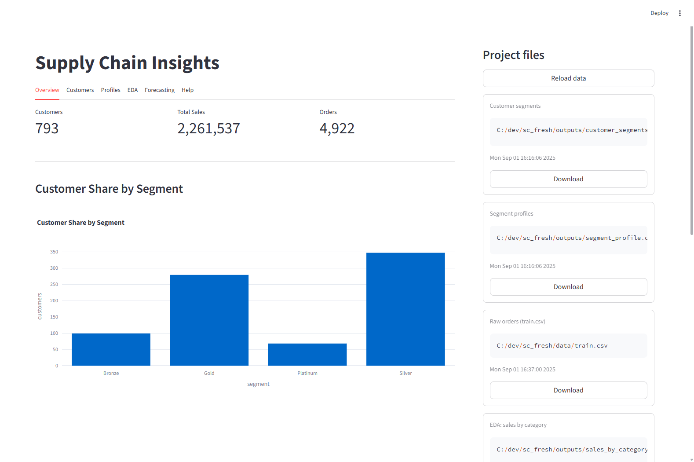
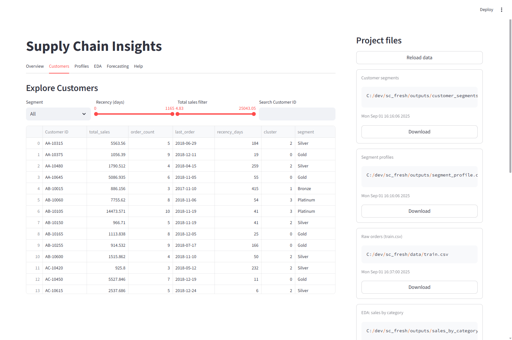
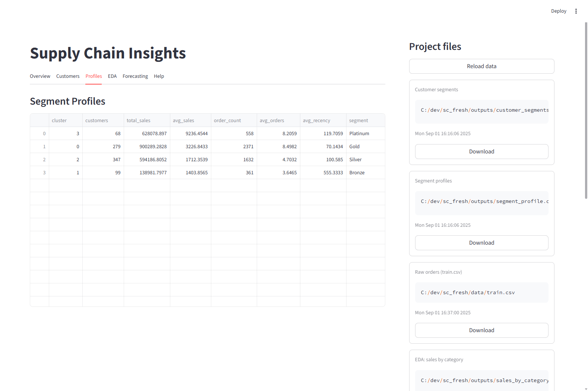
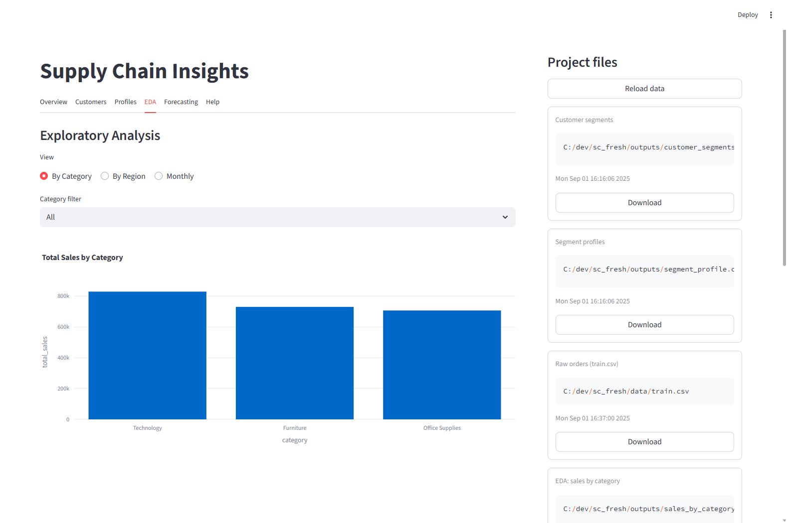
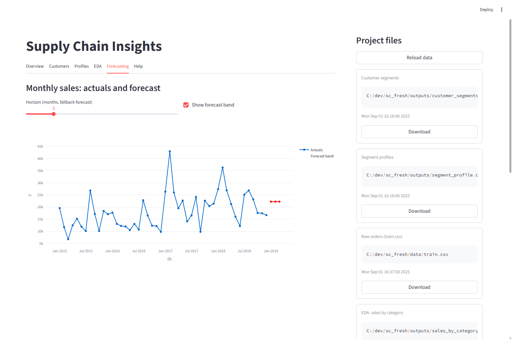

# 📊 Supply Chain Insights Dashboard
*EDA • Segmentation • Forecasting*


---

## 📌 Project Overview
This is an **interactive Streamlit dashboard** built for supply chain analytics.  
It demonstrates:
- **Exploratory Data Analysis (EDA):** Sales by category, region, and time trends.
- **Customer Segmentation:** RFM-style features with KMeans clustering.
- **Forecasting:** Sales forecasts using Prophet (with fallback to rolling mean).

The project is designed to showcase **data engineering + analytics + ML skills** in a single dashboard.

---

## 🖼️ Screenshots

### 🔎 Overview Tab  


### 👥 Customers Tab  


### 🗂️ Profiles Tab  


### 📊 EDA Tab  


### 📈 Forecasting Tab  


---

## ⚡ Run locally

```bash
python -m venv .venv
.\.venv\Scripts\activate
pip install -r requirements.txt
streamlit run app/app.py

### Data setup
- Place your full dataset as `data/train.csv` (kept local / not in Git).
- A tiny demo dataset (`data/sample_data.csv`) is included. To run without real data, copy it to train.csv:
  ```bash
  copy data\sample_data.csv data\train.csv